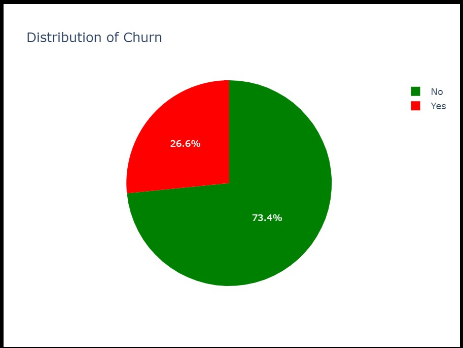
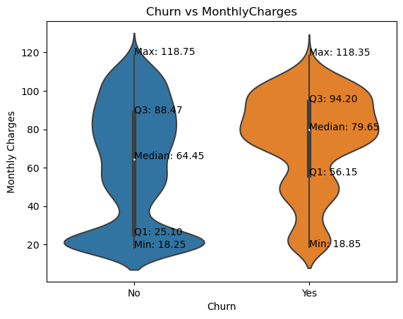
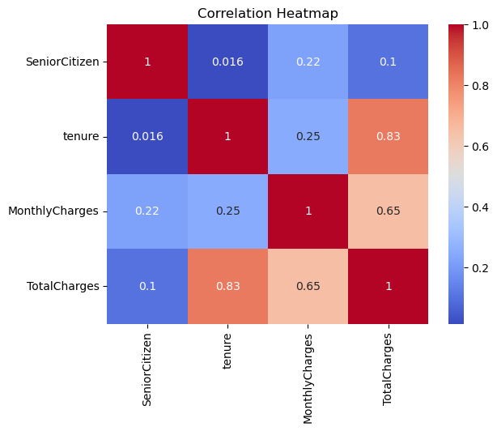
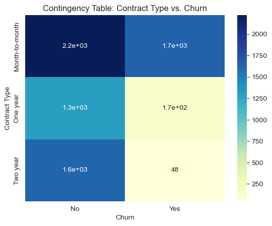
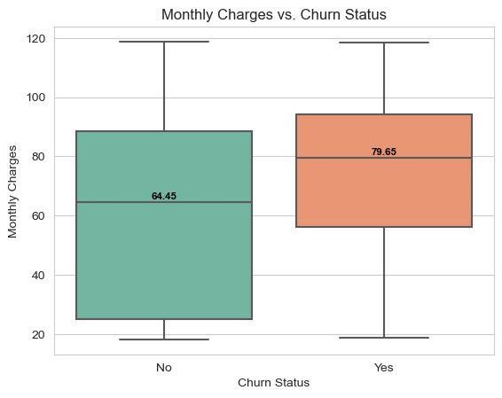
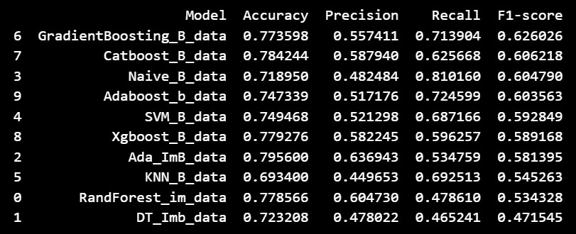
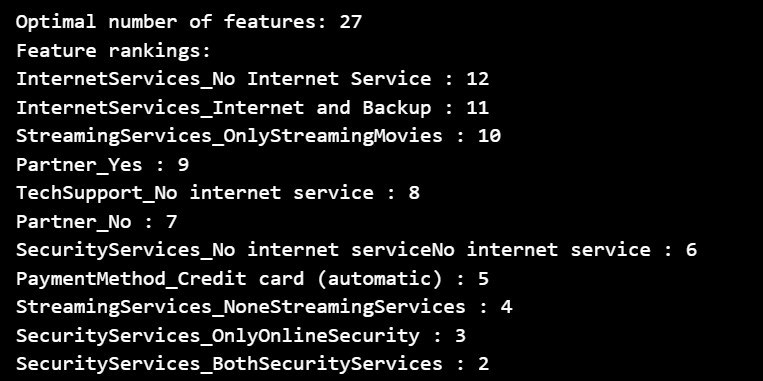
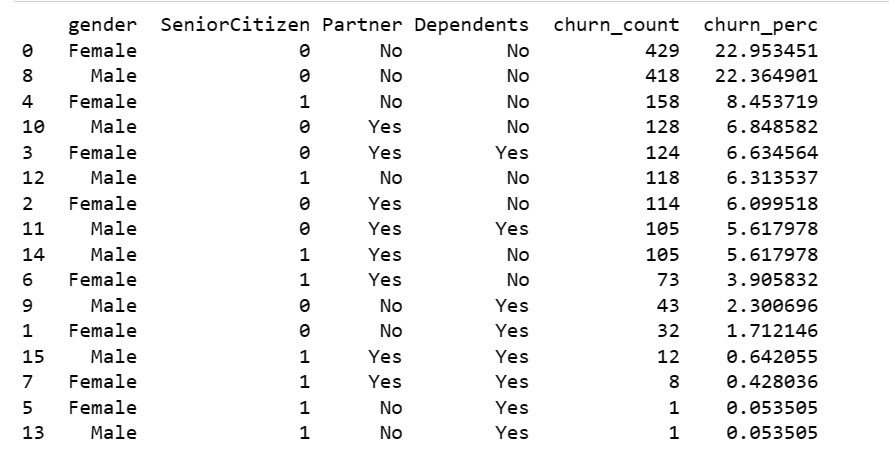

# Customer Churn Analysis and Retention Strategies

🔎 Customer churn is the percentage of customers who stop using a company's product or service within a specific timeframe.

## 📊 Project Objective: 

Identify the likelihood of customer churn, key indicators of churn, and effective retention strategies.

## 🎯 Importance: 

Customer attrition is a significant expenditure for organizations, and understanding churn can help develop effective retention initiatives.

### 📈 Example: 

If you started the year with 500 customers and ended with 480, the churn rate would be 4%.

# 🔍 Project Scope:

1. Analyze customer data to determine the likelihood of churn.

2. Identify key indicators or factors that contribute to customer attrition.

3. Develop retention strategies to prevent customer churn.

4. Evaluate the effectiveness of implemented strategies.

# 💡 Benefits:

1. Improve customer retention rates and reduce churn.

2. Optimize resource allocation by targeting high-risk customers.

3. Enhance customer satisfaction and loyalty.

# 📚 Methodology:

## Data collection: 

Gather customer information, including usage patterns, demographics, and feedback.

### Data Understanding

The data for this project is in a CSV format. The following table describes the columns present in the data:

| Column            | Description                                                                                |
|-------------------|--------------------------------------------------------------------------------------------|
| Gender            | Whether the customer is a male or a female                                                  |
| SeniorCitizen     | Whether a customer is a senior citizen or not                                               |
| Partner           | Whether the customer has a partner or not (Yes, No)                                         |
| Dependents        | Whether the customer has dependents or not (Yes, No)                                        |
| Tenure            | Number of months the customer has stayed with the company                                   |
| Phone Service     | Whether the customer has a phone service or not (Yes, No)                                   |
| MultipleLines     | Whether the customer has multiple lines or not                                              |
| InternetService   | Customer's internet service provider (DSL, Fiber Optic, No)                                |
| OnlineSecurity    | Whether the customer has online security or not (Yes, No, No Internet)                      |
| OnlineBackup      | Whether the customer has online backup or not (Yes, No, No Internet)                        |
| DeviceProtection  | Whether the customer has device protection or not (Yes, No, No internet service)            |
| TechSupport       | Whether the customer has tech support or not (Yes, No, No internet)                         |
| StreamingTV       | Whether the customer has streaming TV or not (Yes, No, No internet service)                 |
| StreamingMovies   | Whether the customer has streaming movies or not (Yes, No, No Internet service)             |
| Contract          | The contract term of the customer (Month-to-Month, One year, Two year)                      |
| PaperlessBilling  | Whether the customer has paperless billing or not (Yes, No)                                 |
| Payment Method    | The customer's payment method (Electronic check, mailed check, Bank transfer(automatic), Credit card(automatic)) |
| MonthlyCharges    | The amount charged to the customer monthly                                                 |
| TotalCharges      | The total amount charged to the customer                                                   |
| Churn             | Whether the customer churned or not (Yes or No)                                             |

## Exploratory data analysis: 

Analyze data to identify patterns, correlations, and potential churn indicators.

### Univariate Analysis 

73.46 % of customers did not churn, and 26.54% of customers did churn which indicates imbalanced data. 

### Bivariate Analysis 

### Multivariate Analysis 

### Hypothesis testing 

The likelihood of a customer leaving the organization is influenced by their contract type

NULL: Customers on 2-year contracts are less likely to churn 

Alternate: Customers on 2-year contracts are more likely to churn

Since the obtained p-value is significantly smaller than the conventional significance level (e.g., 0.05), we can conclude that there is strong evidence to reject the null hypothesis. This suggests that customers on 2-year contracts are more likely to churn, supporting the alternative hypothesis.

### Business question

Is there a relationship between monthly charges and customer churn?

Based on the boxplot, it appears that customers who churn tend to have higher monthly charges compared to those who do not churn

## Churn prediction modeling: 

Develop predictive models using machine learning algorithms to forecast customer churn.

## Feature importance analysis: 

Determine the key factors that influence churn using Recursive feature elimination with cross-validation.  

## Retention strategy development: 

Based on the findings, create strategies to engage and retain customers.

Offer loyalty rewards: Since the highest percentage of churned customers belong to the demographic of females with no partners or dependents and males with no partners or dependents, it may be worth offering these customers loyalty rewards such as discounts, freebies or personalized offers to incentivize them to stay.

# 🚀 Expected Results:

- Accurate identification of customers at risk of churn.

- Insights into the factors driving customer attrition.

-Tailored retention strategies to mitigate churn and improve customer loyalty.

📧 Contact: 

For any questions or concerns, please reach out to :

`Alidu Abubakari`

`Data Analyst`

`Azubi Africa`

-  

Please read more on my medium [EDA Report](https://medium.com/@alidu143/unveiling-the-drivers-of-customer-churn-an-analytical-journey-to-improve-retention-part-1-20fbfd602841), [Machine Learning Models](https://medium.com/@alidu143/unveiling-the-drivers-of-customer-churn-an-analytical-journey-to-improve-retention-part-2-ad561a05c20f) and [retention strategies](https://medium.com/@alidu143/unveiling-the-drivers-of-customer-churn-an-analytical-journey-to-improve-retention-part-3-26b3665d1996)